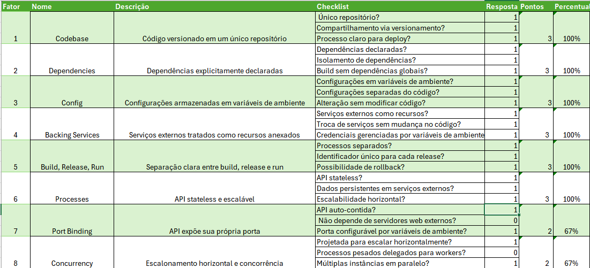
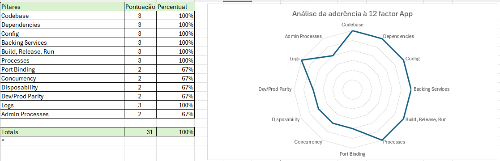

# twelfefactorapp
Repositório com planilha para cálculo de aderência de api´s com Twelve Factor App

Esta planilha ao ser preenchida fornece um resumo avaliando a aderência aos conceitos 12 factor app.

## Tópicos avaliados

Checklist por Fator
1. Codebase  
A API tem um único repositório de código (codebase) versionado?  
O código é compartilhado entre diferentes ambientes (dev, staging, produção) apenas através do versionamento?  
Há um processo claro para deploy a partir do repositório?  

2. Dependencies  
Todas as dependências são explicitamente declaradas (ex: package.json, requirements.txt)?  
As dependências são isoladas (ex: usando virtualenv, Docker, etc.)?
O build da API não depende de pacotes instalados globalmente no sistema?

3. Config
As configurações (ex: chaves de API, credenciais de banco de dados) são armazenadas em variáveis de ambiente?
As configurações são separadas do código-fonte?
É possível alterar configurações sem modificar o código?

4. Backing Services
Serviços externos (banco de dados, filas, cache) são tratados como recursos anexados?
A troca de um serviço externo (ex: MySQL para PostgreSQL) não requer mudanças no código?
As credenciais de serviços externos são gerenciadas via variáveis de ambiente?

5. Build, Release, Run
O processo de build, release e run é separado em etapas distintas?
Cada release tem um identificador único (ex: versão ou timestamp)?
É possível rollback para uma versão anterior sem problemas?

6. Processes
A API é stateless (não armazena estado entre requisições)?
Dados persistentes são armazenados em serviços externos (ex: banco de dados)?
A API pode ser escalada horizontalmente sem problemas?

7. Port Binding
A API é auto-contida e expõe sua própria porta?
Não depende de servidores web externos (ex: Apache, Nginx) para rodar?
A porta pode ser configurada via variáveis de ambiente?

8. Concurrency
A API é projetada para escalar horizontalmente?
Processos pesados são delegados para workers ou filas?
A API lida bem com múltiplas instâncias rodando em paralelo?

9. Disposability
A API pode ser iniciada e parada rapidamente?
Processos são projetados para serem descartáveis (ex: lidam com shutdowns graciosos)?
A API se recupera rapidamente de falhas?

10. Dev/Prod Parity
As diferenças entre ambientes de desenvolvimento e produção são mínimas?
O mesmo código é executado em todos os ambientes?
O mesmo banco de dados e serviços externos são usados em todos os ambientes?

11. Logs
Os logs são tratados como fluxos de eventos (streams)?
A API não se preocupa com o armazenamento ou roteamento de logs?
Os logs são enviados para um sistema centralizado (ex: ELK, Splunk)?

12. Admin Processes
Tarefas administrativas (ex: migrações de banco de dados) são executadas como processos one-off?
Esses processos rodam no mesmo ambiente que a API?
Há documentação clara para executar tarefas administrativas?